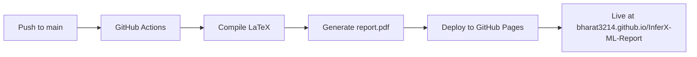

<p align="center">
  
</p>

<h1 align="center">📄 InferX-ML: Automated ML Pipeline for Training and Inference</h1>

<p align="center">
  <strong>Mini Project Report — LaTeX Source</strong><br/>
  Department of Information Technology · A.P. Shah Institute of Technology, Thane<br/>
  Academic Year 2025–2026
</p>

<p align="center">
  
  
  
  
  <a href="https://bharat3214.github.io/InferX-ML-Report/"></a>
</p>

---

## 📑 Table of Contents

- [About the Project](#-about-the-project)
- [Project Structure](#-project-structure)
- [Prerequisites & Dependencies](#-prerequisites--dependencies)
- [Setup on Linux (Ubuntu)](#-setup-on-linux-ubuntu)
- [Setup on Windows](#-setup-on-windows)
- [Compiling the Report](#-compiling-the-report)
- [CI/CD — Auto Deploy with GitHub Actions](#-cicd--auto-deploy-with-github-actions)
- [Troubleshooting](#-troubleshooting)
- [Authors](#-authors)

---

## 📌 About the Project

This repository contains the **LaTeX source files** for the mini project report on **InferX-ML** — an Automated Machine Learning Pipeline for Training and Inference. The report is structured as a standard academic document including title page, certificate, acknowledgement, abstract, chapters, results, conclusion, future scope, and bibliography.

---

## 🗂 Project Structure

```
Mini_PrFormat/
├── report.tex              # Main LaTeX file (entry point)
├── title.tex               # Title page
├── Certificate.tex         # Certificate page
├── Acknowledgement.tex     # Acknowledgement page
├── abstract.tex            # Abstract
├── Introduction.tex        # Chapter 1 — Introduction
├── Review.tex              # Chapter 2 — Literature Review
├── chapter3.tex            # Chapter 3 — System Design
├── chapter4.tex            # Chapter 4 — Implementation
├── chapter5.tex            # Chapter 5 — Testing
├── chapter6.tex            # Chapter 6
├── Result.tex              # Results
├── Conclusion.tex          # Conclusion
├── FutureScope.tex         # Future Scope
├── Bibliography.tex        # References
├── apsit_logo.jpg          # Institute logo
├── images/                 # All figures and diagrams
│   ├── fig1.jpg ... fig7.1.png
│   ├── dfd-0.png ... dfd-2.png
│   ├── sysarc.png
│   └── ...
├── report.pdf              # Compiled output (PDF)
└── README.md               # This file
```

---

## 📦 Prerequisites & Dependencies

This project requires a **LaTeX distribution** and a few standard packages. The packages used in this report are:

| Package      | Purpose                            |
| ------------ | ---------------------------------- |
| `amsmath`    | Advanced math typesetting          |
| `amsfonts`   | Mathematical fonts                 |
| `amssymb`    | Mathematical symbols               |
| `fullpage`   | Adjusts page margins               |
| `graphicx`   | Image/figure inclusion             |
| `float`      | Improved float placement (`[H]`)   |
| `textcomp`   | Additional text symbols            |
| `pdfpages`   | Include external PDF pages         |
| `caption`    | Customise figure/table captions    |
| `tikz`       | Drawing borders and diagrams       |

> **Note:** All of these packages are included in the standard **TeX Live** (Linux) and **MiKTeX** (Windows) distributions. No additional package installation is needed in most cases.

---

## 🐧 Setup on Linux (Ubuntu)

### Step 1 — Update system packages

```bash
sudo apt update && sudo apt upgrade -y
```

### Step 2 — Install TeX Live (Full Distribution)

The full distribution ensures all required LaTeX packages are available out of the box.

```bash
sudo apt install -y texlive-full
```

> 💡 **Lightweight alternative:** If disk space is a concern (~5 GB for full), you can install a smaller set:
>
> ```bash
> sudo apt install -y texlive-latex-base texlive-latex-extra texlive-fonts-recommended texlive-science texlive-pictures
> ```

### Step 3 — Verify the installation

```bash
pdflatex --version
```

You should see output showing the TeX Live version and engine details.

### Step 4 — Install a LaTeX Editor (Optional but Recommended)

**Option A — VS Code with LaTeX Workshop extension:**

```bash
# Install VS Code (if not already installed)
sudo snap install code --classic

# Install the LaTeX Workshop extension
code --install-extension James-Yu.latex-workshop
```

**Option B — Texmaker (dedicated LaTeX editor):**

```bash
sudo apt install -y texmaker
```

**Option C — TeXstudio:**

```bash
sudo apt install -y texstudio
```

### Step 5 — Clone / Download the project

```bash
git clone https://github.com/bharat3214/InferX-ML-Report.git
cd InferX-ML-Report
```

Or simply copy the project folder to your desired location.

### Step 6 — Compile the report

```bash
# Run pdflatex twice to resolve cross-references & TOC
pdflatex report.tex
pdflatex report.tex
```

The compiled PDF will be generated as **`report.pdf`** in the project root.

---

## 🪟 Setup on Windows

### Step 1 — Install MiKTeX (LaTeX Distribution)

1. Download the MiKTeX installer from the official website:  
   🔗 [https://miktex.org/download](https://miktex.org/download)

2. Run the installer and follow the setup wizard:
   - Choose **"Install for all users"** (recommended) or current user only.
   - Select **"Yes"** for *Install missing packages on-the-fly* — this will automatically download any required packages during compilation.

3. After installation, open **MiKTeX Console** and click **Check for updates** to ensure everything is up to date.

### Step 2 — Verify the installation

Open **Command Prompt** or **PowerShell** and run:

```powershell
pdflatex --version
```

If the command is not recognised, you may need to add MiKTeX's `bin` directory to your system **PATH**:

1. Search for **"Environment Variables"** in the Start menu.
2. Under **System Variables**, find `Path` and click **Edit**.
3. Add the MiKTeX bin path (usually `C:\Program Files\MiKTeX\miktex\bin\x64\`).
4. Click **OK** and restart your terminal.

### Step 3 — Install a LaTeX Editor (Optional but Recommended)

**Option A — VS Code with LaTeX Workshop extension:**

1. Download and install VS Code from: [https://code.visualstudio.com/](https://code.visualstudio.com/)
2. Open VS Code, go to the **Extensions** panel (`Ctrl+Shift+X`).
3. Search for **"LaTeX Workshop"** by James Yu and click **Install**.

**Option B — TeXstudio (dedicated LaTeX editor):**

1. Download from: [https://www.texstudio.org/](https://www.texstudio.org/)
2. Run the installer and complete the setup.
3. TeXstudio auto-detects MiKTeX — no extra configuration needed.

**Option C — Texmaker:**

1. Download from: [https://www.xm1math.net/texmaker/](https://www.xm1math.net/texmaker/)
2. Install and configure the LaTeX compiler path if prompted.

### Step 4 — Clone / Download the project

```powershell
git clone https://github.com/bharat3214/InferX-ML-Report.git
cd InferX-ML-Report
```

Or download and extract the ZIP file from the repository.

### Step 5 — Compile the report

**Using Command Prompt / PowerShell:**

```powershell
pdflatex report.tex
pdflatex report.tex
```

**Using VS Code (LaTeX Workshop):**

1. Open the project folder in VS Code.
2. Open `report.tex`.
3. Press `Ctrl+Alt+B` to build, or save the file — LaTeX Workshop compiles automatically on save.
4. Press `Ctrl+Alt+V` to view the PDF.

**Using TeXstudio / Texmaker:**

1. Open `report.tex` in the editor.
2. Click the **Build & View** button (or press `F5` in TeXstudio).

---

## 🔧 Compiling the Report

Regardless of your platform, the report must be compiled **twice** to correctly generate the Table of Contents, List of Figures, List of Tables, and cross-references.

```bash
pdflatex report.tex    # First pass — generates .aux, .toc, .lof, .lot files
pdflatex report.tex    # Second pass — resolves all references
```

### Clean build (remove auxiliary files)

**Linux:**

```bash
rm -f report.aux report.log report.toc report.lof report.lot report.out
pdflatex report.tex
pdflatex report.tex
```

**Windows (PowerShell):**

```powershell
Remove-Item report.aux, report.log, report.toc, report.lof, report.lot, report.out -ErrorAction SilentlyContinue
pdflatex report.tex
pdflatex report.tex
```

---

## 🚀 CI/CD — Auto Deploy with GitHub Actions

This project uses **GitHub Actions** to automatically compile the LaTeX report and deploy it to **GitHub Pages** on every push to `main`.

### How it works



1. **Push changes** — Any contributor pushes `.tex` file changes to the `main` branch.
2. **Auto compile** — GitHub Actions runs `pdflatex` via [`xu-cheng/latex-action`](https://github.com/xu-cheng/latex-action) to build `report.pdf`.
3. **Auto deploy** — The compiled PDF and a viewer page (`index.html`) are deployed to GitHub Pages.
4. **Live link** — The report is instantly available at:  
   👉 **https://bharat3214.github.io/InferX-ML-Report/**

### One-time GitHub Pages setup

To enable GitHub Pages deployment on your repository:

1. Go to your repo on GitHub → **Settings** → **Pages**.
2. Under **Build and deployment → Source**, select **GitHub Actions**.
3. That's it! The next push to `main` will trigger the workflow and deploy automatically.

### Workflow file

The pipeline is defined in [`.github/workflows/build-and-deploy.yml`](.github/workflows/build-and-deploy.yml).

| Trigger         | Branch  | What it does                              |
| --------------- | ------- | ----------------------------------------- |
| `push`          | `main`  | Compile LaTeX & deploy PDF to GitHub Pages |
| `workflow_dispatch` | `main` | Manual trigger from the Actions tab    |

---

## ❓ Troubleshooting

| Issue | Solution |
| ----- | -------- |
| `pdflatex: command not found` | Ensure TeX Live (Linux) or MiKTeX (Windows) is installed and added to your system `PATH`. |
| Missing package error | **Linux:** Run `sudo apt install texlive-latex-extra texlive-pictures` **Windows:** MiKTeX installs missing packages automatically if configured. Open MiKTeX Console → Settings → set *Install missing packages* to **Yes**. |
| Images not found | Ensure the `images/` folder is in the same directory as `report.tex`. Check file names are case-sensitive (Linux). |
| Table of Contents is empty | Compile `report.tex` **twice** — the first pass generates the `.toc` file, the second pass reads it. |
| PDF not updating | Delete auxiliary files (`.aux`, `.toc`, `.log`) and recompile. See [Clean build](#clean-build-remove-auxiliary-files) above. |
| Unicode / encoding errors | Ensure all `.tex` files are saved in **UTF-8** encoding. |

---

## 👥 Authors

| Name                    | Roll No.     |
| ----------------------- | ------------ |
| **Bharatkumar Gungoman** | 23104087    |
| **Alok Gupta**           | 23104045    |
| **Om Babar**             | 23104217    |

**Guide:** Ms. Sneha Dalvi  
**Institution:** A.P. Shah Institute of Technology, Thane  
**Department:** Information Technology (NBA Accredited)

---

<p align="center">
  Made with ❤️ using LaTeX
</p>
